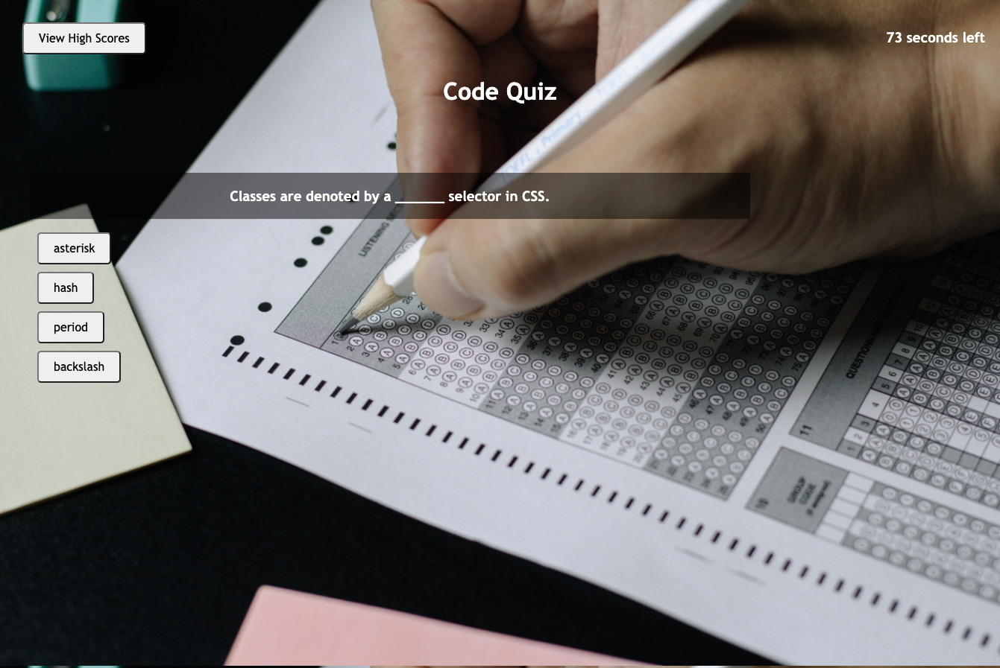

# Code-Quiz
Unit 4: Web APIs Homework

## Description

This application is a timed coding quiz which stores the player's score. 

* When the question is answered correctly, the score is increased  by 10 pts and the player moves on to the next question.
* When the question is answered incorrectly, the player does not receive points for the question and the timer decrements 15 seconds as a penalty.
* When the game is over the player can see their final score and enter their initials to save their score.
* They should then be able to see a list of high scores on the high scores page.

The following issues still need to be resolved:
* Currently, the score is being stored to local storage, but the scores are not displaying on the high score page.
* When the game is played multiple times, the high scores need to be sorted by score from highest to lowest and display the highest three.

## Usage
Deployed link to live site can be found at: https://suejinkim20.github.io/Code-Quiz/

When the "Start Quiz" button is clicked, the following pop-up box appears: 

## Credits

* Tutorials used:
    * https://www.w3schools.com/js/default.asp
    * https://developer.mozilla.org/en-US/docs/Web/JavaScript
* Tutoring help received from:
    * Bootcamp Tutor
    * TAs in Office Hours

## License

MIT License

Copyright (c) [2021] [Sue Jin Kim]

Permission is hereby granted, free of charge, to any person obtaining a copy of this software and associated documentation files (the "Software"), to deal in the Software without restriction, including without limitation the rights to use, copy, modify, merge, publish, distribute, sublicense, and/or sell copies of the Software, and to permit persons to whom the Software is furnished to do so, subject to the following conditions:

The above copyright notice and this permission notice shall be included in all copies or substantial portions of the Software.

THE SOFTWARE IS PROVIDED "AS IS", WITHOUT WARRANTY OF ANY KIND, EXPRESS OR IMPLIED, INCLUDING BUT NOT LIMITED TO THE WARRANTIES OF MERCHANTABILITY, FITNESS FOR A PARTICULAR PURPOSE AND NONINFRINGEMENT. IN NO EVENT SHALL THE AUTHORS OR COPYRIGHT HOLDERS BE LIABLE FOR ANY CLAIM, DAMAGES OR OTHER LIABILITY, WHETHER IN AN ACTION OF CONTRACT, TORT OR OTHERWISE, ARISING FROM, OUT OF OR IN CONNECTION WITH THE SOFTWARE OR THE USE OR OTHER DEALINGS IN THE SOFTWARE.